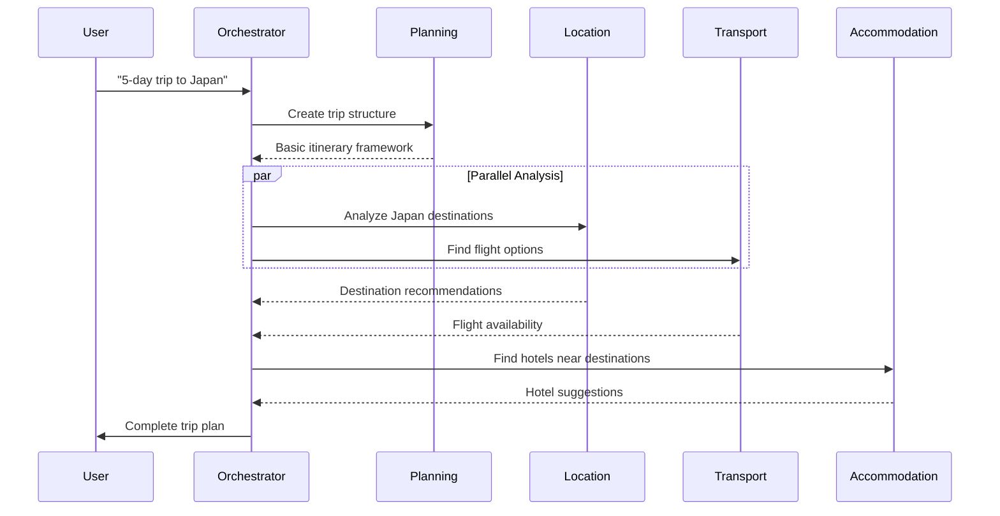
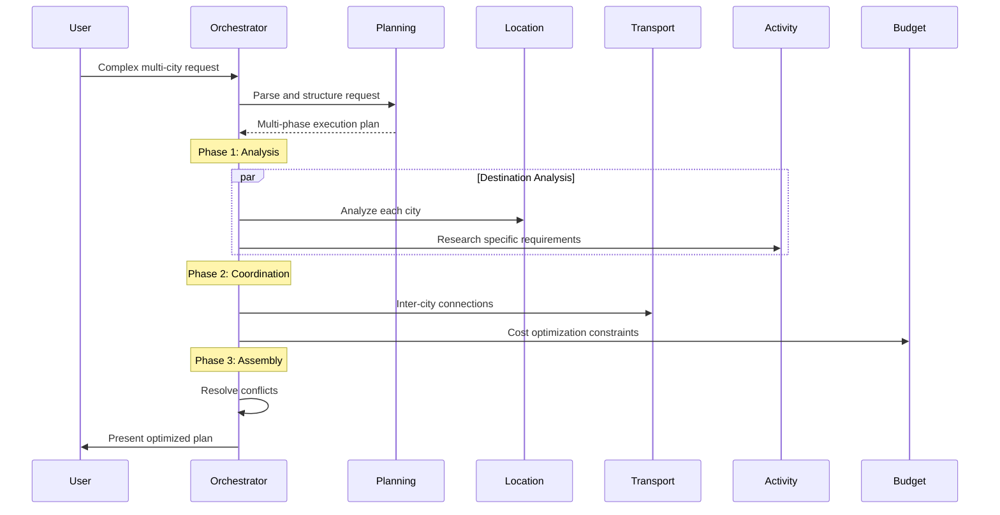

# Orchestration Architecture

## 🎯 Master Orchestrator Design

The Master Orchestrator serves as the central coordination hub for all agent activities in the Travel Planner system. It manages task delegation, agent communication, state coordination, and user interaction flows.

## 🏗️ Core Architecture Components

### 1. Request Parser & Planner
**Purpose**: Analyze user requests and create execution plans

```
Input: Natural language trip request
Processing:
  - Intent extraction (destinations, dates, preferences)
  - Constraint identification (budget, time, requirements)
  - Priority ranking of user needs
  - Complexity assessment for agent allocation
Output: Structured execution plan with agent task assignments
```

**Key Responsibilities**:
- Parse complex natural language inputs
- Identify explicit and implicit requirements
- Determine agent involvement needed
- Create optimal task execution sequence
- Handle ambiguous or incomplete requests

### 2. Agent Registry & Manager
**Purpose**: Track available agents and their capabilities

```
Agent Registry Schema:
{
  "agent_id": "location-agent-001",
  "agent_type": "location",
  "status": "available|busy|offline",
  "capabilities": ["destination_analysis", "poi_discovery", "route_optimization"],
  "current_load": 3,
  "max_capacity": 10,
  "response_time_avg": "2.3s",
  "context_window": 4096,
  "cost_per_request": 0.02
}
```

**Dynamic Agent Management**:
- Real-time agent status monitoring
- Load balancing across agent instances
- Automatic scaling based on demand
- Health checks and failure detection
- Cost optimization through smart routing

### 3. Task Delegation Engine
**Purpose**: Assign tasks to appropriate agents with optimal resource utilization

#### Task Prioritization Matrix
| Priority | Task Type | Example | Agent Assignment |
|----------|-----------|---------|-----------------|
| P0 | Critical Path | Flight availability | Single dedicated agent |
| P1 | High Impact | Accommodation booking | Primary + backup agent |
| P2 | Standard | Activity suggestions | Shared agent pool |
| P3 | Optional | Local tips | Batch processing |

#### Task Delegation Flow
```
1. Receive execution plan from Request Parser
2. Break down into agent-specific tasks
3. Assess agent availability and capabilities
4. Calculate optimal assignment considering:
   - Agent specialization score
   - Current load and response time
   - Context requirements
   - Cost implications
5. Create task queues with dependencies
6. Monitor execution and adjust as needed
```

### 4. State Management System
**Purpose**: Coordinate shared state across all agents and maintain consistency

#### State Architecture
```
Global State:
├── Trip Context
│   ├── destinations: ["Tokyo", "Kyoto"]
│   ├── dates: { start: "2024-03-15", end: "2024-03-22" }
│   ├── travelers: { adults: 2, children: 0 }
│   └── preferences: { budget: "moderate", style: "cultural" }
├── Agent Results
│   ├── location-agent: { analyzed_destinations: [...] }
│   ├── transport-agent: { flight_options: [...] }
│   └── accommodation-agent: { hotel_suggestions: [...] }
└── Dependencies
    ├── hotel_selection → activity_planning
    ├── flight_booking → ground_transport
    └── weather_check → activity_filtering
```

#### State Synchronization Patterns
- **Event Sourcing**: All state changes recorded as events
- **CQRS**: Separate read/write models for optimization
- **Optimistic Locking**: Conflict resolution for concurrent updates
- **Snapshot Management**: Periodic state snapshots for recovery

### 5. Inter-Agent Communication Hub
**Purpose**: Facilitate secure and efficient communication between agents

#### Communication Protocols
```
Message Format:
{
  "message_id": "msg_20240315_001",
  "from_agent": "location-agent-001",
  "to_agent": "activity-agent-002",
  "message_type": "data_request|result_share|status_update",
  "payload": {
    "destinations": ["Tokyo", "Kyoto"],
    "context": "user_prefers_temples"
  },
  "priority": "high|medium|low",
  "timestamp": "2024-03-15T10:30:00Z",
  "requires_response": true,
  "timeout": 30
}
```

#### Message Routing Strategies
- **Direct Messaging**: Point-to-point for specific requests
- **Publish-Subscribe**: Broadcast for shared updates
- **Message Queues**: Asynchronous processing for non-critical updates
- **Event Streaming**: Real-time coordination for time-sensitive tasks

## 🔄 Orchestration Workflows

### 1. Simple Trip Planning Workflow


### 2. Complex Multi-City Workflow


## 🛡️ Error Handling & Resilience

### Error Categories & Recovery Strategies

#### 1. Agent Failures
```
Detection: Health check timeouts, invalid responses
Recovery:
  - Automatic retry with exponential backoff
  - Failover to backup agent instance
  - Graceful degradation with reduced functionality
  - User notification for critical failures
```

#### 2. Communication Failures
```
Detection: Message delivery failures, network timeouts
Recovery:
  - Message queue persistence and replay
  - Alternative communication channels
  - Circuit breaker patterns
  - Emergency fallback to simplified responses
```

#### 3. Data Inconsistency
```
Detection: State validation checks, cross-agent verification
Recovery:
  - Rollback to last consistent state
  - Re-execution of failed agent tasks
  - Manual intervention interfaces
  - User confirmation for major changes
```

### Monitoring & Observability

#### Key Metrics Dashboard
```
Orchestrator Health:
├── Request Processing Time: < 5s (target)
├── Agent Success Rate: > 95% (target)
├── State Consistency Score: 100% (target)
├── User Satisfaction: > 4.5/5 (target)
└── Cost per Request: < $0.50 (target)

Agent Performance:
├── Individual Response Times
├── Success/Failure Rates
├── Context Window Utilization
├── Cost per Agent Type
└── Load Distribution
```

#### Alerting System
- **Critical**: Agent cluster failures, data corruption
- **Warning**: High response times, low success rates
- **Info**: Usage patterns, optimization opportunities

## 🔧 Configuration Management

### Orchestrator Configuration
```yaml
orchestrator:
  max_concurrent_requests: 100
  default_timeout: 30s
  retry_attempts: 3
  circuit_breaker_threshold: 10
  
agents:
  location:
    max_instances: 5
    scale_threshold: 80%
    context_window: 4096
  transport:
    max_instances: 3
    scale_threshold: 75%
    context_window: 8192
    
communication:
  message_queue_size: 1000
  batch_size: 10
  compression: true
  encryption: true
```

### Environment-Specific Settings
- **Development**: Single agent instances, verbose logging
- **Staging**: Reduced capacity, full monitoring
- **Production**: Full redundancy, optimized performance

## 📊 Performance Optimization

### Caching Strategies
```
Cache Levels:
1. Request-level: Identical user requests
2. Agent-level: Common queries per agent type
3. Data-level: External API responses
4. Result-level: Complete trip plan components
```

### Resource Management
- **Agent Pool Management**: Dynamic scaling based on demand
- **Context Window Optimization**: Smart context pruning
- **Batch Processing**: Group similar requests for efficiency
- **Predictive Scaling**: Anticipate demand spikes

## 🔍 Integration Points

### Backend API Integration
```
Endpoints for Orchestrator:
- POST /api/trips/plan - Submit new trip request
- GET /api/trips/{id}/status - Check planning progress
- PUT /api/trips/{id}/modify - Modify specific components
- DELETE /api/trips/{id}/cancel - Cancel planning process
```

### Frontend Integration
```
WebSocket Events:
- trip_planning_started
- agent_task_completed
- planning_progress_update
- trip_plan_ready
- modification_applied
```

### Database Integration
```
Tables Used:
- trip_requests: User request storage
- agent_tasks: Task tracking and status
- trip_state: Current planning state
- agent_results: Agent output storage
```

---

**Key Design Principles:**
1. **Fault Tolerance**: System continues operating with partial agent failures
2. **Scalability**: Horizontal scaling of individual agent types
3. **Observability**: Complete visibility into system behavior
4. **Cost Efficiency**: Optimal resource utilization and cost management
5. **User Experience**: Fast, reliable, and transparent planning process