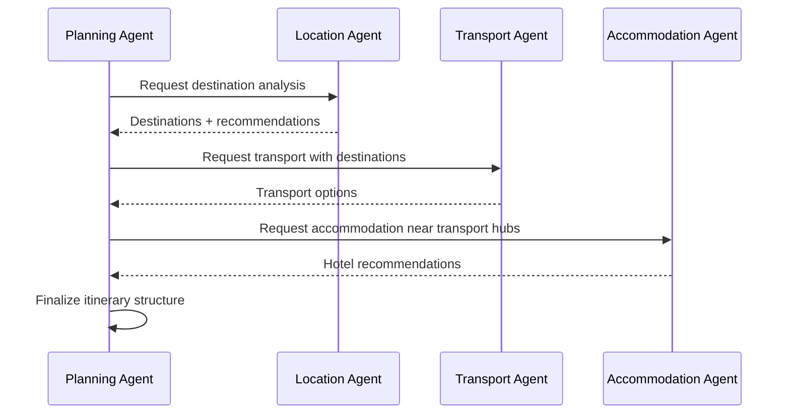
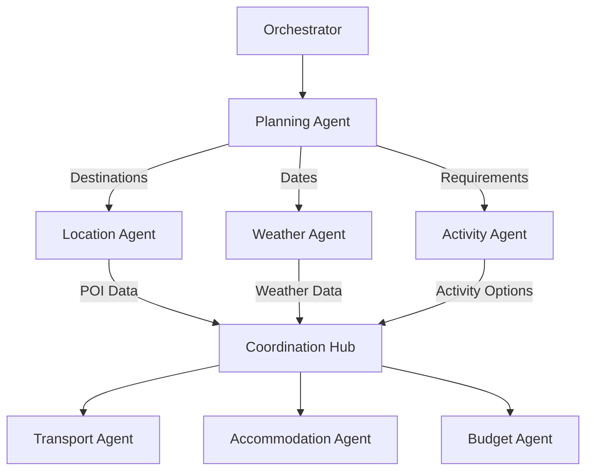
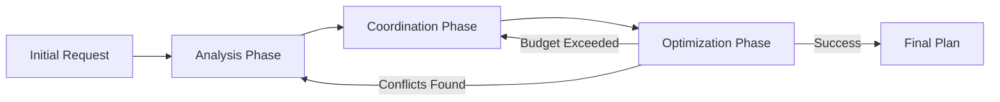

# Communication Flow & Agent Coordination

## 🎯 Communication Architecture Overview

The Travel Planner's multi-agent system uses a **hybrid communication model** combining direct messaging, publish-subscribe patterns, and event streaming to ensure efficient, reliable, and scalable agent coordination.

## 📡 Communication Protocols

### 1. Message Types & Formats

#### Standard Message Structure
```json
{
  "message_id": "msg_20240315_001",
  "timestamp": "2024-03-15T10:30:00Z",
  "from_agent": {
    "id": "planning-agent-001",
    "type": "planning",
    "instance": "prod-planning-01"
  },
  "to_agent": {
    "id": "location-agent-002", 
    "type": "location",
    "instance": "prod-location-01"
  },
  "message_type": "data_request|result_share|status_update|coordination_request",
  "priority": "critical|high|medium|low",
  "correlation_id": "trip_req_12345",
  "payload": {
    "request_type": "destination_analysis",
    "context": {
      "trip_id": "trip_12345",
      "destinations": ["Tokyo", "Kyoto"],
      "user_preferences": ["temples", "gardens"]
    }
  },
  "response_required": true,
  "timeout": 30,
  "retry_policy": {
    "max_attempts": 3,
    "backoff_strategy": "exponential"
  }
}
```

#### Message Type Specifications

**1. Data Request Messages**
```json
{
  "message_type": "data_request",
  "payload": {
    "request_type": "destination_analysis|transport_options|accommodation_search",
    "parameters": {
      "locations": ["Tokyo"],
      "dates": {"start": "2024-03-15", "end": "2024-03-22"},
      "constraints": {"budget_max": 5000}
    },
    "context_level": "minimal|standard|detailed",
    "response_format": "json|structured_text"
  }
}
```

**2. Result Share Messages**
```json
{
  "message_type": "result_share",
  "payload": {
    "agent_output": {
      "confidence_score": 0.92,
      "processing_time": "3.2s",
      "tokens_used": 1847,
      "cost": 0.08
    },
    "results": {
      "primary_recommendations": [...],
      "alternatives": [...],
      "metadata": {...}
    },
    "dependencies": ["requires_budget_validation", "affects_activity_planning"]
  }
}
```

**3. Coordination Request Messages**
```json
{
  "message_type": "coordination_request",
  "payload": {
    "coordination_type": "conflict_resolution|dependency_check|optimization_sync",
    "affected_components": ["hotel_selection", "activity_timing"],
    "proposed_changes": {...},
    "impact_assessment": "low|medium|high",
    "requires_consensus": true
  }
}
```

### 2. Communication Patterns

#### Direct Messaging (Point-to-Point)
```
Use Cases:
- Specific data requests between agents
- Private coordination for conflict resolution
- Critical path communications requiring acknowledgment

Flow:
Agent A → Message Queue → Agent B → Acknowledgment → Agent A
```

#### Publish-Subscribe Pattern
```
Use Cases:
- Broadcast state changes to interested agents
- Notify multiple agents of context updates
- Distribute global configuration changes

Flow:
Publisher Agent → Topic/Channel → Multiple Subscriber Agents
```

#### Event Streaming
```
Use Cases:
- Real-time trip planning status updates
- Live coordination during peak processing
- User interface updates and notifications

Flow:
Agent → Event Stream → Real-time Processing → UI/Database Updates
```

## 🔄 Agent Coordination Workflows

### 1. Sequential Coordination
**Use Case**: Dependencies require ordered execution



### 2. Parallel Coordination
**Use Case**: Independent analysis can run simultaneously



### 3. Iterative Coordination
**Use Case**: Optimization requires multiple refinement passes



## 📊 Real-Time Coordination Mechanisms

### 1. Conflict Resolution Protocol

#### Conflict Types & Resolution Strategies
```
Conflict Type: Resource Availability
Example: Hotel unavailable after flight change
Resolution:
1. Detect conflict through dependency checking
2. Identify affected agents (Accommodation, Budget)
3. Request alternatives from Accommodation Agent
4. Validate budget impact with Budget Agent
5. Update trip plan with resolved options

Conflict Type: Budget Constraint Violation
Example: Activity selections exceed budget
Resolution:
1. Budget Agent signals constraint violation
2. Orchestrator identifies cost reduction strategies
3. Activity Agent provides lower-cost alternatives
4. User notification for preference confirmation
5. Re-optimization with new constraints
```

#### Conflict Resolution Flow
```python
class ConflictResolution:
    def handle_conflict(self, conflict_data):
        # 1. Identify conflict type and affected agents
        conflict_type = self.classify_conflict(conflict_data)
        affected_agents = self.identify_affected_agents(conflict_data)
        
        # 2. Gather alternative options
        alternatives = []
        for agent in affected_agents:
            agent_alternatives = agent.get_alternatives(conflict_data)
            alternatives.extend(agent_alternatives)
        
        # 3. Evaluate alternatives and select best option
        best_option = self.evaluate_alternatives(alternatives, conflict_data)
        
        # 4. Apply resolution and notify agents
        self.apply_resolution(best_option)
        self.notify_affected_agents(affected_agents, best_option)
        
        return best_option
```

### 2. State Synchronization

#### Shared State Management
```json
{
  "trip_state": {
    "trip_id": "trip_12345",
    "version": 15,
    "last_updated": "2024-03-15T10:30:00Z",
    "state_locks": {
      "transport": "transport-agent-001",
      "accommodation": null
    },
    "pending_changes": [
      {
        "agent": "budget-agent",
        "change_type": "cost_update",
        "timestamp": "2024-03-15T10:29:45Z"
      }
    ],
    "global_context": {
      "destinations": ["Tokyo", "Kyoto"],
      "dates": {"start": "2024-03-15", "end": "2024-03-22"},
      "budget": {"total": 5000, "spent": 2800, "remaining": 2200}
    }
  }
}
```

#### State Update Protocol
```
1. Agent requests state lock for specific component
2. Orchestrator grants lock or queues request
3. Agent performs changes and updates state
4. Agent releases lock and notifies interested parties
5. Dependent agents receive state change notifications
6. Conflict detection runs on state changes
```

## ⚙️ Model-Specific Communication Optimization

### Communication Overhead by Agent Tier

#### Tier 1 Agents (Premium Models - GPT-5)
```yaml
Planning Agent:
  communication_frequency: "low"  # Fewer, more comprehensive messages
  message_complexity: "high"     # Rich context, detailed requests
  response_timeout: 30s
  retry_strategy: "conservative" # Fewer retries, higher reliability

Transport Agent:
  communication_frequency: "medium"
  message_complexity: "high"
  response_timeout: 25s
  retry_strategy: "aggressive"   # Important for bookings
```

#### Tier 2 Agents (Standard Models - GPT-5-mini)
```yaml
Location Agent:
  communication_frequency: "medium"
  message_complexity: "medium"
  response_timeout: 15s
  retry_strategy: "standard"

Accommodation Agent:
  communication_frequency: "medium" 
  message_complexity: "medium"
  response_timeout: 20s
  retry_strategy: "standard"

Activity Agent:
  communication_frequency: "high"   # Many activity options
  message_complexity: "medium"
  response_timeout: 15s
  retry_strategy: "standard"
```

#### Tier 3 Agents (Efficient Models - GPT-5-nano)
```yaml
Weather Agent:
  communication_frequency: "low"    # Simple, infrequent requests
  message_complexity: "low"
  response_timeout: 10s
  retry_strategy: "minimal"

Budget Agent:
  communication_frequency: "high"   # Frequent cost updates
  message_complexity: "low"         # Simple calculations
  response_timeout: 8s
  retry_strategy: "fast_fail"       # Quick retry cycles
```

## 🛡️ Message Reliability & Error Handling

### 1. Message Delivery Guarantees

#### At-Least-Once Delivery
```
Implementation:
- Message acknowledgments required
- Automatic retry with exponential backoff
- Dead letter queues for failed messages
- Duplicate detection and idempotency

Use Case: Critical coordination messages
```

#### Best-Effort Delivery
```
Implementation:
- Fire-and-forget messaging
- No delivery guarantees
- Lower latency and overhead

Use Case: Status updates, non-critical notifications
```

### 2. Circuit Breaker Pattern
```python
class AgentCircuitBreaker:
    def __init__(self, agent_id, failure_threshold=5, recovery_timeout=60):
        self.agent_id = agent_id
        self.failure_count = 0
        self.failure_threshold = failure_threshold
        self.state = "CLOSED"  # CLOSED, OPEN, HALF_OPEN
        self.last_failure_time = None
        self.recovery_timeout = recovery_timeout
    
    def call_agent(self, message):
        if self.state == "OPEN":
            if self.should_attempt_reset():
                self.state = "HALF_OPEN"
            else:
                raise CircuitBreakerOpenException(f"Agent {self.agent_id} unavailable")
        
        try:
            response = self.send_message_to_agent(message)
            self.on_success()
            return response
        except Exception as e:
            self.on_failure()
            raise e
    
    def on_success(self):
        self.failure_count = 0
        self.state = "CLOSED"
    
    def on_failure(self):
        self.failure_count += 1
        self.last_failure_time = time.time()
        if self.failure_count >= self.failure_threshold:
            self.state = "OPEN"
```

## 📈 Performance Monitoring & Optimization

### Key Communication Metrics
```yaml
Message Processing Metrics:
  - average_response_time_per_agent
  - message_success_rate
  - queue_depth_by_priority
  - agent_utilization_rate
  - cost_per_message_by_agent_tier

Network Metrics:
  - bandwidth_utilization
  - connection_pool_usage
  - ssl_handshake_time
  - message_compression_ratio

Error Metrics:
  - timeout_rate_by_agent
  - retry_attempts_average
  - circuit_breaker_activations
  - dead_letter_queue_size
```

### Communication Optimization Strategies
```
1. Message Batching: Group similar requests for efficiency
2. Context Compression: Reduce message payload sizes
3. Smart Routing: Route messages based on agent load
4. Predictive Scaling: Scale communication infrastructure based on demand
5. Connection Pooling: Reuse connections for multiple messages
```

## 🔧 Environment Configuration for Communication

### .env Configuration Example
```env
# Communication Settings
MESSAGE_QUEUE_TYPE=redis|rabbitmq|aws_sqs
MESSAGE_RETENTION_HOURS=24
MAX_MESSAGE_SIZE_KB=64
COMPRESSION_ENABLED=true
ENCRYPTION_ENABLED=true

# Agent Communication Timeouts (by tier)
TIER1_AGENT_TIMEOUT_SECONDS=30
TIER2_AGENT_TIMEOUT_SECONDS=15  
TIER3_AGENT_TIMEOUT_SECONDS=10

# Retry Policies
DEFAULT_MAX_RETRIES=3
CRITICAL_MESSAGE_MAX_RETRIES=5
EXPONENTIAL_BACKOFF_BASE=2

# Circuit Breaker Settings  
CIRCUIT_BREAKER_FAILURE_THRESHOLD=5
CIRCUIT_BREAKER_RECOVERY_TIMEOUT=60
CIRCUIT_BREAKER_ENABLED=true

# Performance Monitoring
COMMUNICATION_METRICS_ENABLED=true
DETAILED_LOGGING_ENABLED=false
PERFORMANCE_ALERT_THRESHOLD_MS=5000
```

## 🔍 Integration with Agent Models

### Model-Aware Message Routing
```python
class ModelAwareRouter:
    def route_message(self, message, target_agent_type):
        agent_config = self.get_agent_config(target_agent_type)
        
        # Adjust message based on model capabilities
        if agent_config.model_tier == "tier1":
            # Premium models can handle complex context
            message = self.enhance_message_context(message)
        elif agent_config.model_tier == "tier3":
            # Efficient models need simplified context
            message = self.simplify_message_context(message)
        
        # Route to appropriate agent instance
        agent_instance = self.select_agent_instance(
            target_agent_type, 
            agent_config,
            message.priority
        )
        
        return self.send_message(message, agent_instance)
```

---

**Key Communication Principles:**
1. **Reliability**: Messages are delivered reliably with appropriate guarantees
2. **Scalability**: Communication scales with agent load and system demand  
3. **Efficiency**: Optimized for different model tiers and agent capabilities
4. **Observability**: Complete visibility into communication patterns and performance
5. **Fault Tolerance**: Graceful handling of communication failures and agent unavailability