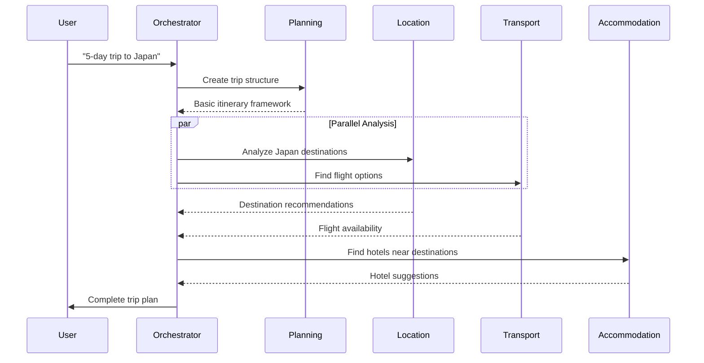
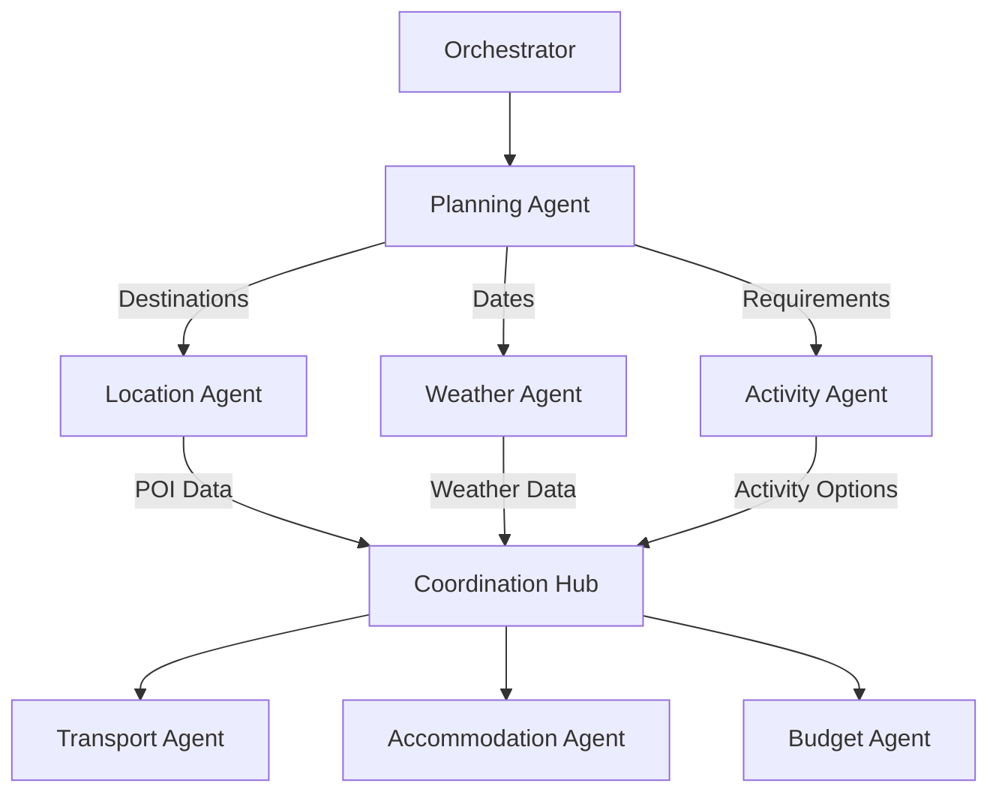
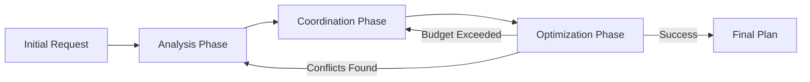
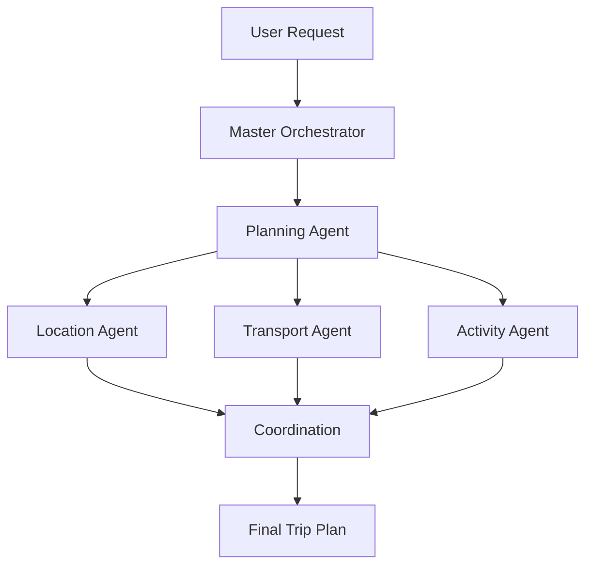

# 📊 Graph Visualization Guide

## 🎯 Viewing Agent System Diagrams

The agent documentation contains several **Mermaid diagrams** that visualize system workflows and architecture. Since VS Code doesn't natively display these, here are the best ways to view them:

## 🔧 VS Code Extensions (Recommended)

### **Mermaid Markdown Syntax Highlighting**
1. Install the **"Mermaid Markdown Syntax Highlighting"** extension
2. Install the **"Markdown Preview Mermaid Support"** extension
3. Open any `.md` file with diagrams
4. Press `Ctrl+Shift+V` (or `Cmd+Shift+V` on Mac) to open Markdown preview
5. Diagrams will render as interactive graphics

### **Installation Commands**
```bash
# In VS Code, open Command Palette (Ctrl+Shift+P) and run:
ext install bierner.markdown-mermaid
ext install bpruitt-goddard.mermaid-markdown-syntax-highlighting
```

## 🌐 Online Viewers (Instant Access)

### **Mermaid Live Editor**
1. Go to: https://mermaid.live/
2. Copy any mermaid code block from our documentation
3. Paste into the editor
4. View real-time rendered diagram
5. Export as PNG, SVG, or PDF

### **GitHub Online Viewing**
1. Push the documentation to GitHub
2. GitHub automatically renders Mermaid diagrams in markdown files
3. Best for sharing with team members

## 📍 Diagram Locations in Documentation

### **Communication Flow Diagrams** (`03-communication-flow.md`)

#### Sequential Coordination Workflow


#### Parallel Coordination Workflow


#### Iterative Coordination Workflow


### **UI Integration Diagrams** (`05-user-interface-integration.md`)

These diagrams show the interactive graph-based trip visualization and real-time agent coordination interfaces.

## 🎨 Creating Interactive Visualizations

### **For Development Use**
```typescript
// React component for rendering Mermaid diagrams
import mermaid from 'mermaid';

const AgentFlowDiagram: React.FC<{ diagramCode: string }> = ({ diagramCode }) => {
  useEffect(() => {
    mermaid.initialize({ startOnLoad: true });
    mermaid.contentLoaded();
  }, []);

  return (
    <div className="mermaid-diagram">
      {diagramCode}
    </div>
  );
};
```

### **For Documentation Websites**
```html
<!-- Include Mermaid.js for automatic rendering -->
<script src="https://cdn.jsdelivr.net/npm/mermaid/dist/mermaid.min.js"></script>
<script>mermaid.initialize({startOnLoad:true});</script>
```

## 📱 Mobile/Tablet Viewing

### **GitHub Mobile App**
1. Install GitHub mobile app
2. Navigate to repository
3. View markdown files with rendered diagrams
4. Pinch to zoom for detailed view

### **Mermaid Mobile Apps**
- **Mermaid Chart** (iOS/Android)
- **Draw.io** mobile app (supports Mermaid import)

## 🖼️ Exporting Diagrams

### **High-Quality Images**
1. Use Mermaid Live Editor: https://mermaid.live/
2. Paste diagram code
3. Click "Actions" → "Download PNG/SVG"
4. Use in presentations or documentation

### **Editable Formats**
1. Export as SVG for vector editing
2. Import into Figma, Adobe Illustrator, or Draw.io
3. Customize colors, fonts, and layout

## 🔄 Interactive Trip Graph Prototype

For the actual **interactive trip graph** mentioned in our UI documentation, you'll need to build it using:

### **Recommended Libraries**
```javascript
// React-based graph visualization
import { ReactFlow, Node, Edge } from 'reactflow';
import 'reactflow/dist/style.css';

// D3.js for custom visualizations
import * as d3 from 'd3';

// Cytoscape.js for complex graph interactions
import cytoscape from 'cytoscape';
```

### **Sample Trip Graph Component**
```typescript
interface TripNode {
  id: string;
  type: 'flight' | 'hotel' | 'activity';
  agentResponsible: string;
  data: any;
}

const TripGraph: React.FC = () => {
  const nodes: Node[] = [
    {
      id: 'flight-1',
      type: 'transport',
      position: { x: 100, y: 100 },
      data: { 
        label: 'NYC → Tokyo',
        agent: 'transport',
        status: 'confirmed'
      }
    },
    {
      id: 'hotel-1', 
      type: 'accommodation',
      position: { x: 300, y: 100 },
      data: {
        label: 'Grand Tokyo Hotel',
        agent: 'accommodation',
        status: 'planning'
      }
    }
  ];

  return (
    <ReactFlow
      nodes={nodes}
      edges={edges}
      onNodeClick={handleNodeClick}
      onEdgeClick={handleEdgeClick}
    />
  );
};
```

## 🎯 Quick Start for Viewing Diagrams

### **Immediate Solution** (No installations)
1. Go to https://mermaid.live/
2. Copy this sample diagram:

3. Paste and view the rendered diagram
4. This shows how agents coordinate in our system

### **VS Code Solution** (Best for development)
1. Install extensions: `bierner.markdown-mermaid`
2. Open `docs/agents/03-communication-flow.md`
3. Press `Ctrl+Shift+V` to preview
4. View all diagrams rendered inline

---

**Diagram Index:**
- **Agent Workflows**: `03-communication-flow.md` (3 workflow diagrams)
- **UI Components**: `05-user-interface-integration.md` (interface mockups)
- **System Architecture**: `01-orchestration-architecture.md` (system design)
- **Implementation Flow**: `06-implementation-guide.md` (development process)

All diagrams are designed to be **interactive** and **editable** - perfect for iterating on the system design!