# Database Relationships & Architecture Diagrams

## 🎯 Database Architecture Overview

This document provides visual representations of our dual database architecture, showing relationships between PostgreSQL tables and Qdrant collections, as well as data flow patterns.

## 📊 PostgreSQL Entity Relationship Diagram

### Core Tables Relationship

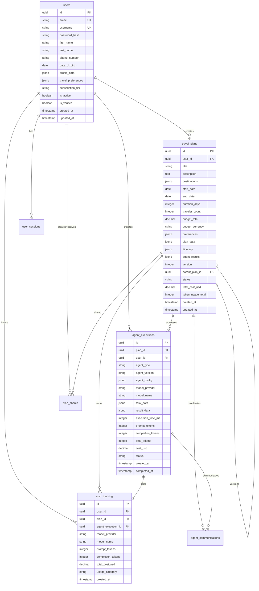

### Agent Communication Flow

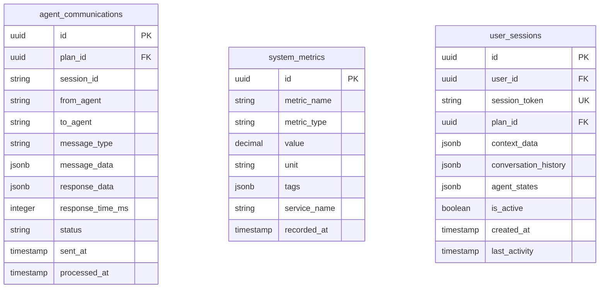

## 🔍 Vector Database Collection Relationships

### Qdrant Collections Architecture

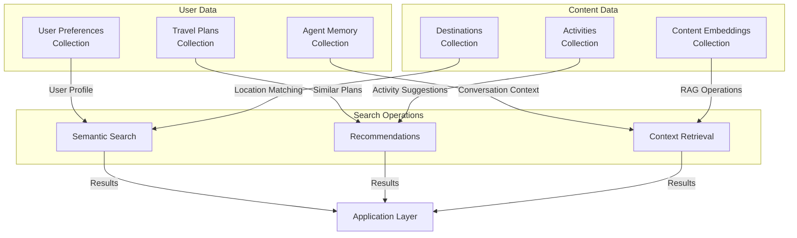

### Vector Search Flow

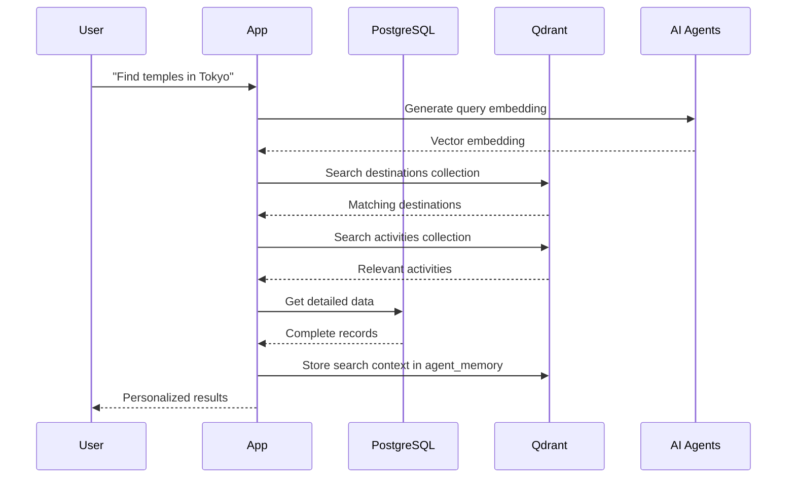

## 🔄 Data Flow Architecture

### PostgreSQL ↔ Qdrant Synchronization

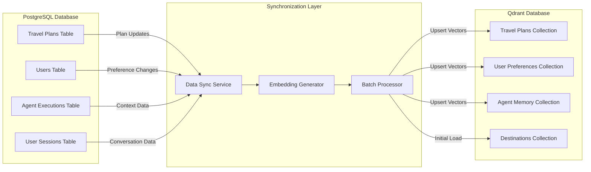

### Multi-Agent Data Access Pattern

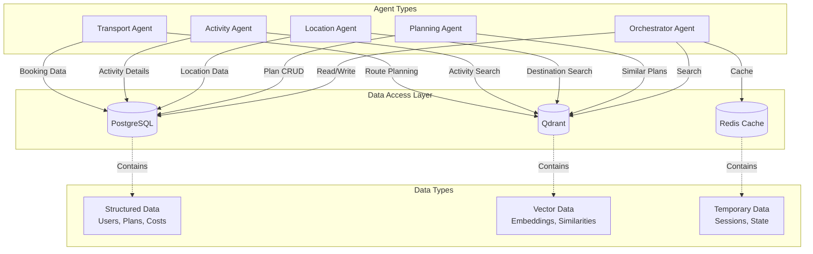

## 📈 Performance Architecture

### Database Scaling Strategy

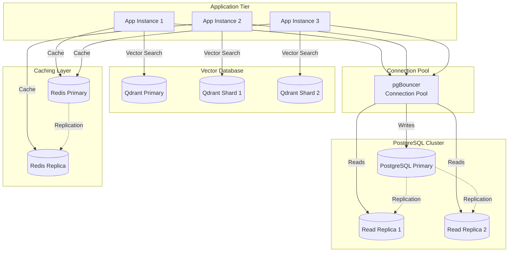

### Query Performance Optimization

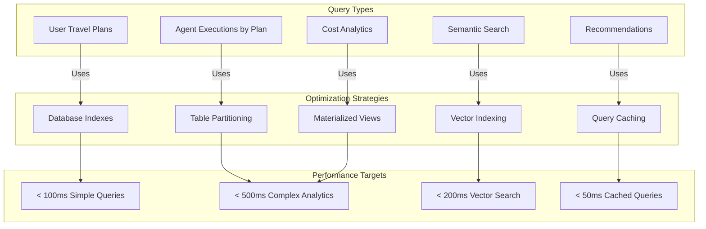

## 🔐 Security Architecture

### Data Access Control

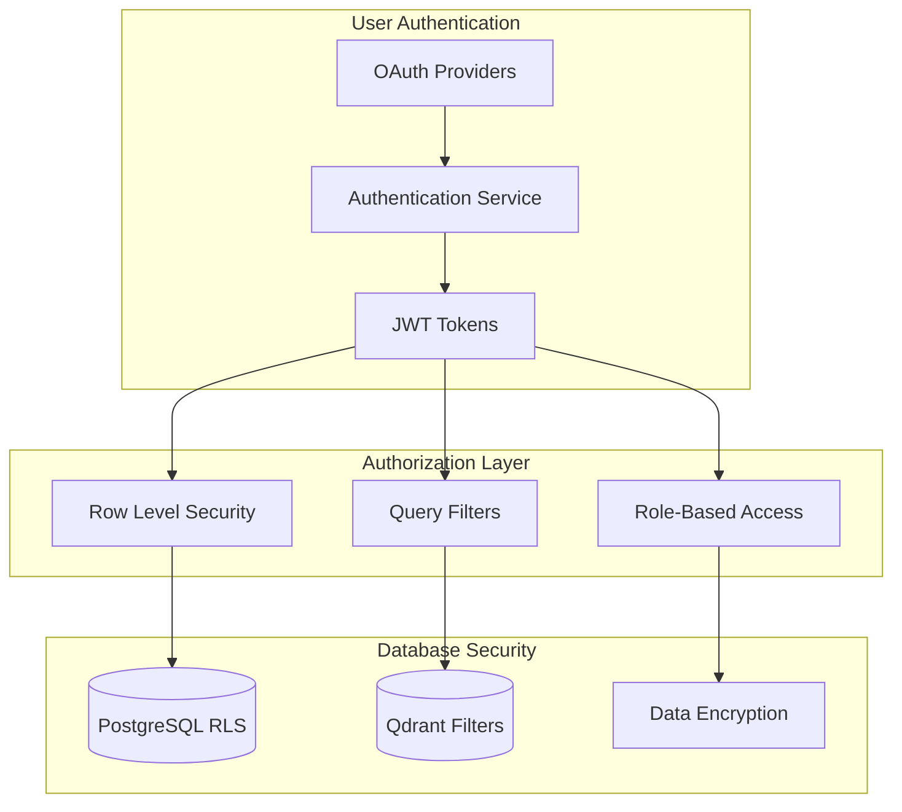

### Data Privacy Compliance

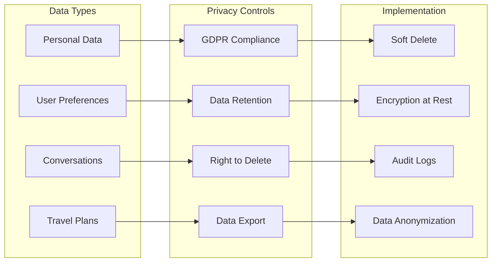

## 🔄 Backup & Recovery Architecture

### Backup Strategy

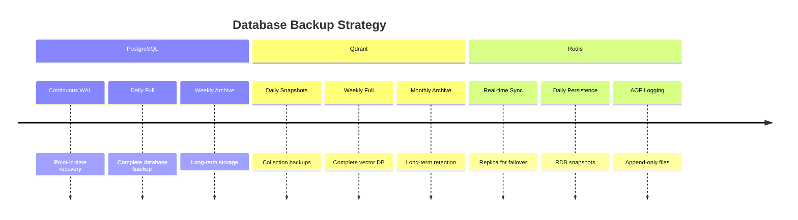

### Disaster Recovery Flow

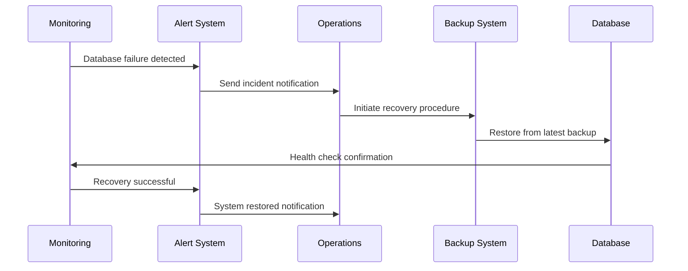

## 📊 Monitoring & Observability

### Database Metrics Dashboard

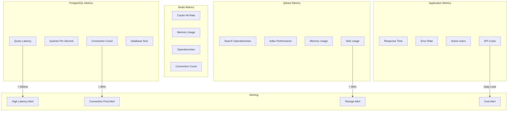

This database relationship documentation provides:

✅ **Visual Architecture** - Clear diagrams showing system relationships  
✅ **Data Flow Patterns** - How data moves between systems  
✅ **Performance Strategy** - Scaling and optimization approaches  
✅ **Security Design** - Access control and privacy compliance  
✅ **Operational Readiness** - Backup, recovery, and monitoring  
✅ **Development Guide** - Clear understanding for implementation  
✅ **Troubleshooting Aid** - Diagrams help identify issues  
✅ **Documentation Standard** - Consistent visual language