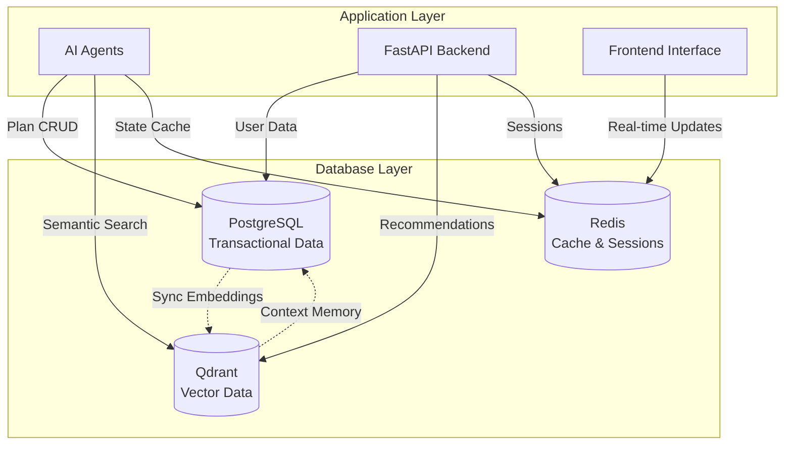

# Database Architecture Overview

## 🎯 Dual Database Strategy

Our travel planner uses a **dual database architecture** optimized for different data types and access patterns:

### 📊 **Primary Database: PostgreSQL 15+**
- **Purpose**: Transactional data, user management, travel plans, agent tracking
- **Rationale**: ACID compliance, advanced JSON support, excellent performance on ARM64
- **Features**: Complete audit trails, cost tracking, version control, multi-agent coordination

### 🔍 **Vector Database: Qdrant**
- **Purpose**: Vector embeddings, semantic search, RAG capabilities, AI agent memory
- **Rationale**: High-performance vector operations, local deployment, excellent Python integration
- **Features**: Similarity search, recommendation engine, contextual agent memory

### ⚡ **Caching Layer: Redis**
- **Purpose**: Session storage, rate limiting, frequently accessed data, agent state caching
- **Features**: Fast in-memory operations, pub/sub for real-time updates

## 📁 Database Documentation Files

### [01-postgresql-schema.md](./01-postgresql-schema.md)
**Purpose**: Complete PostgreSQL database schema design  
**Contents**: 
- Comprehensive table definitions with agent tracking
- Advanced indexing strategy for ARM64 optimization
- Triggers, functions, and views for automation
- Row-level security and performance optimization
- Cost tracking and monitoring capabilities

### [02-vector-database-qdrant.md](./02-vector-database-qdrant.md)
**Purpose**: Vector database schema and configuration  
**Contents**:
- Qdrant collection definitions for all vector operations
- Semantic search patterns and recommendation queries
- Agent memory management and context storage
- Vector synchronization with PostgreSQL
- Performance optimization for ARM64 deployment

### [03-relationships-diagrams.md](./03-relationships-diagrams.md)
**Purpose**: Visual database architecture and relationships  
**Contents**:
- Entity relationship diagrams for PostgreSQL
- Vector database collection relationships
- Data flow patterns between systems
- Performance and scaling architecture
- Security and backup strategies

### [04-environment-setup.md](./04-environment-setup.md)
**Purpose**: Complete environment configuration guide  
**Contents**:
- Development and production setup instructions
- Docker configurations optimized for ARM64
- Connection pooling and performance tuning
- Monitoring and health check implementations
- Security configuration and best practices

## 🏗️ Database Architecture Principles

### 1. **Separation of Concerns**
- **PostgreSQL**: ACID transactions, user data, plan management, agent coordination
- **Qdrant**: Vector operations, semantic search, AI memory, recommendations
- **Redis**: Fast caching, sessions, rate limiting, temporary data

### 2. **Performance Optimization**
- ARM64-optimized configurations for Oracle Cloud
- Connection pooling with PgBouncer
- Intelligent indexing strategies
- Vector quantization for memory efficiency

### 3. **Data Integrity & Security**
- Row-level security policies
- Complete audit trails
- User data isolation
- GDPR compliance ready

### 4. **Scalability Design**
- Horizontal scaling preparation
- Read replica support
- Vector database sharding capability
- Microservice-ready architecture

## 🔄 Data Flow Architecture

### Multi-Agent System Integration

### Data Synchronization Patterns

- **Real-time Sync**: Critical user data between PostgreSQL and Qdrant
- **Batch Processing**: Large-scale embedding generation and updates  
- **Event-driven Updates**: Plan changes trigger vector updates
- **Memory Management**: Automatic cleanup of expired agent memory

## 📊 Database Status & Implementation

| Component | Schema Design | Documentation | Environment Setup |
|-----------|---------------|---------------|-------------------|
| PostgreSQL Schema | ✅ Complete | ✅ Complete | ✅ Complete |
| Vector Database | ✅ Complete | ✅ Complete | ✅ Complete |
| Relationships/Diagrams | ✅ Complete | ✅ Complete | ✅ Complete |
| Environment Config | ✅ Complete | ✅ Complete | ✅ Complete |
| Migration Scripts | ⏳ Planned | ⏳ Planned | ⏳ Planned |
| Seed Data | ⏳ Planned | ⏳ Planned | ⏳ Planned |

**Legend**: ✅ Complete | 🟡 In Progress | ⏳ Planned

## 🚀 Quick Start Guide

### For Database Administrators
1. **Review Architecture**: Start with [Relationships & Diagrams](./03-relationships-diagrams.md)
2. **Environment Setup**: Follow [Environment Setup Guide](./04-environment-setup.md)
3. **Schema Implementation**: Deploy [PostgreSQL Schema](./01-postgresql-schema.md)
4. **Vector Database**: Configure [Qdrant Collections](./02-vector-database-qdrant.md)

### For Backend Developers
1. **Database Integration**: Review connection patterns in [Environment Setup](./04-environment-setup.md)
2. **Data Models**: Understand schema from [PostgreSQL Schema](./01-postgresql-schema.md)
3. **Vector Operations**: Learn patterns from [Vector Database](./02-vector-database-qdrant.md)
4. **Performance**: Optimize using [Relationships & Diagrams](./03-relationships-diagrams.md)

### For AI/Agent Developers
1. **Agent Memory**: Review vector patterns in [Vector Database](./02-vector-database-qdrant.md)
2. **Cost Tracking**: Understand tracking from [PostgreSQL Schema](./01-postgresql-schema.md)
3. **Data Flow**: Study agent integration from [Relationships](./03-relationships-diagrams.md)

## 🔍 Integration Points

This database architecture integrates with:
- **[Backend APIs](../backend/README.md)**: Database connection and ORM patterns
- **[AI Agents](../agents/README.md)**: Agent memory and coordination patterns
- **[Frontend](../frontend/README.md)**: Real-time data and caching strategies
- **[Security](../security/README.md)**: Authentication and authorization patterns

## 📋 Implementation Checklist

### Database Setup
- [ ] Set up PostgreSQL 15+ with ARM64 optimization
- [ ] Deploy Qdrant vector database
- [ ] Configure Redis caching layer
- [ ] Set up PgBouncer connection pooling
- [ ] Implement health monitoring

### Schema Implementation
- [ ] Create PostgreSQL tables and indexes
- [ ] Initialize Qdrant collections
- [ ] Set up triggers and functions
- [ ] Configure row-level security
- [ ] Implement data retention policies

### Integration Development
- [ ] Create SQLAlchemy models
- [ ] Implement Qdrant client wrapper
- [ ] Set up Redis cache manager
- [ ] Create health check endpoints
- [ ] Implement monitoring and alerting

### Data Management
- [ ] Create migration scripts
- [ ] Prepare seed data
- [ ] Set up backup procedures
- [ ] Configure monitoring dashboards
- [ ] Test disaster recovery

---

**Last Updated**: September 4, 2025  
**Version**: 2.0.0  
**Architecture**: Dual Database (PostgreSQL + Qdrant + Redis)  
**Target Platform**: Oracle Cloud ARM64